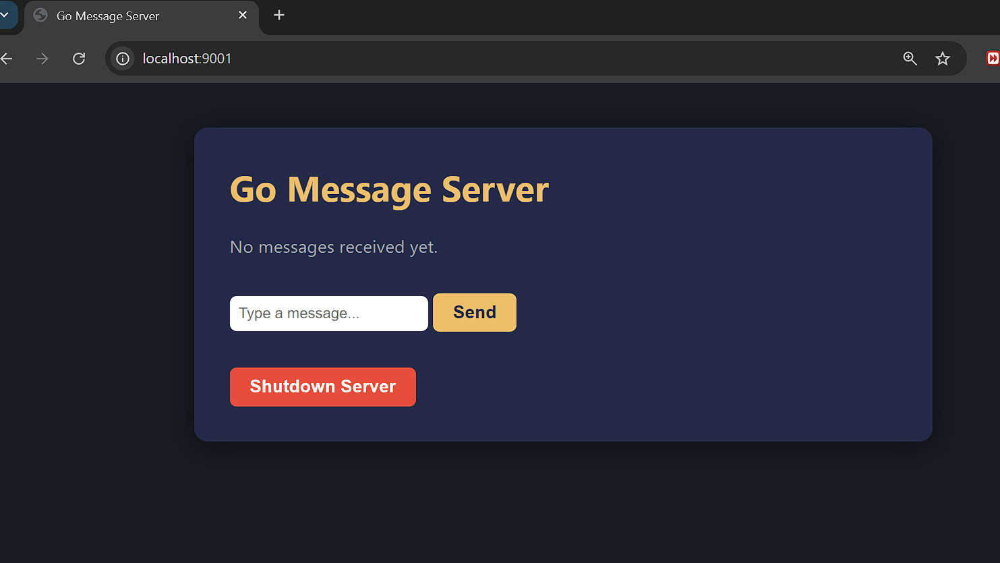
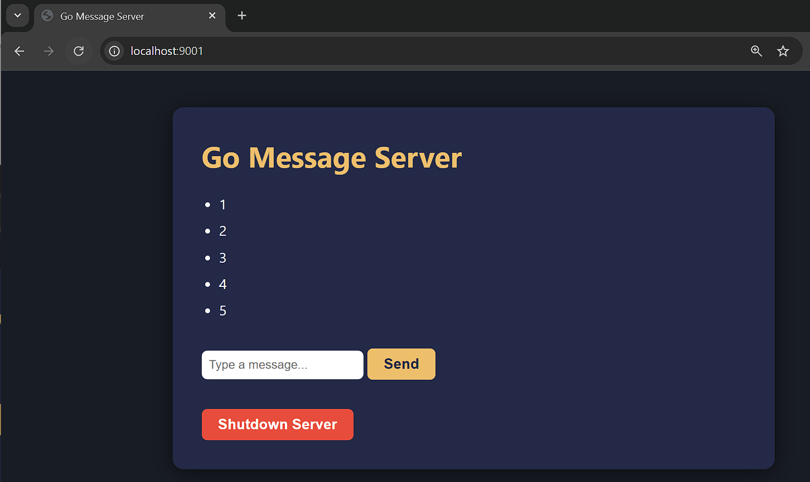

# parallel-programming-swarm-simulation
This project demonstrates a distributed parallel simulation of a drone swarm exploring a 3D arena. Each drone runs as a separate MPI process, communicating with a central Tower coordinator to synchronize global state, avoid collisions, and track exploration coverage.

## Project Screenshots (from original project)

## Starter Kit

<!-- Placeholders for Starter Kit screenshots -->

*go server before running the cpp*

*and after ./cpp_to_go_http_client*

*Core modules provided for extension.*

## Included in the Starter Kit
- **gui/**: Modular OpenGL/GLUT utilities for 3D visualization and camera control.
- **collid/**: Collision detection logic for 3D points and spheres.
- **examples/**: Minimal, ready-to-run C++ demos for students (moving dots, collision, etc.).
- **mpi/**: MPI examples for distributed messaging and struct communication.
- **go_server/**: Go HTTP server and C++ clients for telemetry and message passing.
- **modules/**: Basic simulation classes (Drone, Tower, World, Messaging) for extension.

## How to Use
1. Start with the examples folder to learn how to use the GUI and collision modules.
2. Use the mpi folder for distributed simulation and messaging.
3. Extend the modules (Drone, Tower, World) to implement your own swarm logic.
4. Use the go_server folder for telemetry or web-based messaging demos.

## Build & Run
- Each example and module includes build/run instructions at the top of the file.
- Most C++ code can be built with g++ or mpic++ (for MPI).
- The Go server can be built with `go build` and run directly.

## Folder Structure
- **gui/**: All GUI drawing and camera logic
- **collid/**: Collision detection functions
- **examples/**: Student-facing demos
- **mpi/**: MPI messaging and struct examples
- **go_server/**: Go server and C++ HTTP clients
- **modules/**: Simulation classes for extension

---
For more details, see the README in each folder.
